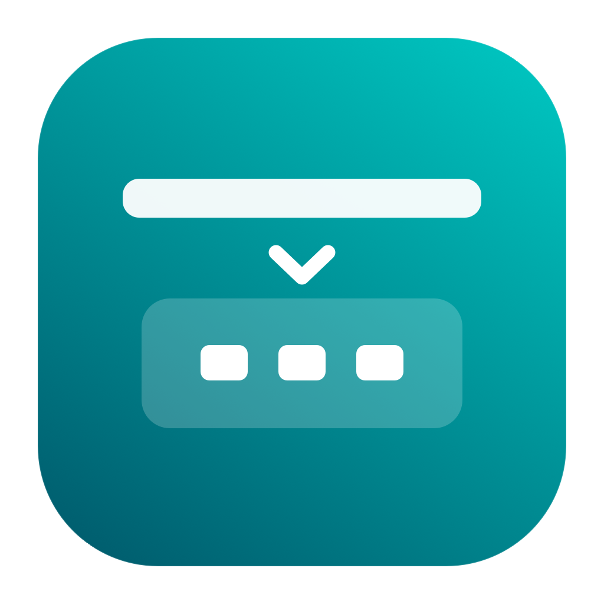

<a id="english"></a>

<p align="center">
  
</p>

<h1 align="center">MBAR</h1>

<p align="center"><strong>A cleaner dropdown for the macOS 27 menu bar.</strong></p>

<p align="center">
  <a href="#english"></a>
  <a href="#中文"></a>
</p>

<p align="center">
  <a href="https://github.com/QiushanHuang/MBAR/releases/latest"></a>
  
  
  
  <a href="LICENSE"></a>
</p>

**macOS 27 changed the menu bar. Get your frequently used icons back within easy reach.**
MBAR puts supported apps' original menu icons in a compact dropdown below its
entry—close to your pointer, without capturing the menu-bar background.

[**Download MBAR**](https://github.com/QiushanHuang/MBAR/releases/latest) ·
[Getting started](#install) · [App compatibility](#app-compatibility) ·
[Release notes](docs/releases/v0.4.0.md) · [Report an issue](https://github.com/QiushanHuang/MBAR/issues)

## Why choose MBAR on macOS 27?

macOS 27's menu-bar redesign disrupted older per-icon capture techniques. Its
native overflow expands leftward along the top bar; screenshot-based panels can
face clipped, faded or background-tinted icons. **MBAR pairs a dropdown close to
your pointer with direct loading of original icon resources.**

| The friction | Why choose MBAR |
| --- | --- |
| Native overflow sends you left along the top bar to find a tool | **Less pointer travel:** frequently used icons sit together below the MBAR entry |
| Screen crops can include background, lose edges or look soft after resizing | **Cleaner artwork:** supported apps' original menu resources, without captured wallpaper or menu-bar pixels |
| Some capture paths need hidden icons revealed before taking a snapshot | **Less visual disruption:** no expand–capture–collapse cycle to populate the shelf |
| Capturing menu-bar images requires Screen Recording access | **One less permission:** the current resource-based shelf needs no Screen Recording permission |

Best for a small collection of supported apps you open often. Artwork is static,
Accessibility is required, and resource adapters do not yet cover every app.
[Architecture and capture references](#original-artwork-without-the-screenshot-baggage)
explain the method comparison; these issues do not affect every competing implementation.

**Early release:** hiding uses a private macOS 27 interface and remains experimental.
The current app UI is in Simplified Chinese; this README documents both languages.
Original artwork is static, not a live mirror of connection state or animated charts.

### macOS 27 changed the menu bar. MBAR changes how you reach it.

macOS 27 introduced a native `«` overflow control and consolidated menu-bar
rendering into a shared `MenuBarAgent` window. Older techniques that depended on
separate icon windows can no longer be carried over unchanged. The native overflow
reveals additional items along the top bar, extending leftward; it does not provide
a separate dropdown shelf. See [MenubarHide's macOS 27 implementation notes](https://github.com/junior-rj/menubar-hide#macos-27).

**Keep your tools close to the click.** MBAR opens a compact row below its entry.
For a small collection of frequently used tools, that means less horizontal
pointer travel and less searching along the top edge—especially on a wide screen.
This is a layout advantage, not a measured speed claim; the benefit depends on your
icon count and arrangement.

| Everyday interaction | MBAR's approach |
| --- | --- |
| Open the shelf, then choose a tool | Icons appear together below the entry, within a short pointer movement |
| Keep the native bar visually settled while browsing | Loading shelf artwork does not expand the system overflow to take a picture |
| Reach several tools in succession | Lock the shelf open and keep the same row available |
| Separate everyday tools from rarely used ones | Auto-hide appears in the shelf; Always-hide stays out of it |

The shelf has its own horizontal scrolling area rather than competing for the
remaining space beside app menus and the notch. Clicking a tool may still reveal
its native item to open the original menu.

### Original artwork, without the screenshot baggage

Some secondary-bar implementations capture menu-bar imagery and display cropped
snapshots. For example, [iBar's permission explanation](https://www.better365.com/h-nd-183.html)
describes obtaining icons from screen images. Such a route can preserve rendered
status information, but its result depends on what the system makes capturable.

**MBAR reads supported apps' original menu-icon resources directly.** It draws the
icon on the shelf's own background, without sampling wallpaper or menu-bar pixels.

| Screenshot/crop risk | What resource loading avoids in MBAR |
| --- | --- |
| Background or tint gets baked into the crop | No captured desktop or menu-bar background around the icon |
| Cropping or rescaling softens edges or clips part of a glyph | Original resource pixels or vector representations, drawn at the shelf's size; quality still depends on the source asset |
| Occlusion, inactive-display dimming or changing coordinates affect the image | Artwork loading is independent of the icon's on-screen visibility and crop rectangle |
| Hidden icons need to be revealed before capture | No expand–capture–collapse cycle just to populate the shelf |
| Screen Recording permission is needed for image acquisition | No Screen Recording permission for the current resource-based shelf; Accessibility is still required |

These are differences between rendering methods, not a claim that every screenshot
implementation looks wrong. [Pelmet's source history](https://github.com/fif7y/pelmet/blob/be992df108355c8673621a5ba66ce94cf98daff0/Pelmet/Editor/ItemImageCache.swift)
records dimming, notch occlusion and identifier drift in its former shared-window
capture path—concrete examples of why capture can be fragile.

**The tradeoff is deliberate:** clean, complete source artwork for adapted apps,
rather than a live reproduction of every app's changing icon. Unsupported apps
still need adapters, and status-specific artwork or custom charts may not match
what is currently drawn in the native bar. See [App compatibility](#app-compatibility).

## Install

Requires **macOS 27 and an Apple Silicon Mac**. The release is ad-hoc signed,
without a Developer ID signature or Apple notarization. No Intel build is supplied.

1. Download `MBAR-0.4.0-macos-arm64.dmg` from [Releases](https://github.com/QiushanHuang/MBAR/releases/latest).
2. Open the disk image and drag **MBAR** to **Applications**. Eject the image.
   Alternatively, extract the ZIP and move `MBAR.app` to Applications.
3. Open MBAR from Applications. It lives in the menu bar and has no Dock icon.
4. If macOS blocks opening, use **System Settings → Privacy & Security → Open Anyway**
   after reviewing the download. Do not disable Gatekeeper globally.
5. In MBAR, click **打开辅助功能设置** (Open Accessibility Settings), enable MBAR,
   return to the app and click **刷新** (Refresh). The system permission may be
   labeled **Device Control and Data Access** on macOS 27.

Run from `/Applications/MBAR.app`: development or disk-image locations may not be
recognized correctly by the system hiding allowlist. Keep each target app enabled
in the system's **Menu Bar → Allow in Menu Bar** settings; disabling it there
removes the item rather than assigning it to MBAR.

You can verify either download against the release's `SHA256SUMS.txt`:

```sh
shasum -a 256 MBAR-0.4.0-macos-arm64.dmg
# Compare the result with its line in SHA256SUMS.txt.
```

## Start here

1. Launch the menu-bar apps you want to organize, then click **刷新** (Refresh).
2. Choose a category beside each app:

   | UI label | Meaning |
   | --- | --- |
   | 常驻菜单栏 | Visible: stays in the system menu bar |
   | 自动隐藏 | Auto-hide: appears in MBAR's dropdown |
   | 总是隐藏 | Always-hide: excluded from the dropdown; temporarily open it from Settings |

3. Click **打开下拉栏** (Open shelf) to check the supported icons.
4. Turn on **启用隐藏** (Enable hiding) when ready. A fresh installation starts
   with hiding off. Categories and the enabled preference survive normal restarts.

| Action | Control |
| --- | --- |
| Open or close the shelf | Left-click MBAR's downward arrow |
| Open the original app menu | Left-click its shelf icon |
| Send the original right-click | Right-click its shelf icon; behavior depends on the target app |
| Open MBAR Settings | Shelf gear, or right-click MBAR → 设置… |
| Keep the shelf open | Click the lock; click again to unlock |
| Dismiss an unlocked shelf | Click outside, press Escape, or click MBAR again |
| Hide the lock button | Disable 在下拉栏显示锁定按钮 in Settings |
| Temporarily open an Always-hide app | Use the arrow-out button beside it in Settings |
| Restore all icons and pause hiding | Right-click MBAR → 显示全部图标, or Settings → 显示全部（暂停） |
| Quit | Right-click MBAR → 退出 MBAR |

A locked shelf ignores normal dismissal, including Escape and menu-item clicks;
recovery can still close it. Unlock it to close it normally. Lock state is temporary.
Apps with multiple menu-bar items are categorized together.

## App compatibility

The current resource adapters cover the following apps. This is an implementation
list, not a guarantee across every app version: resource names, archives or binary
artwork may change in an upstream update.

| Resource source | Apps |
| --- | --- |
| Named menu resources | KeepingYouAwake, MonitorControl, Tailscale, BuhoNTFS Menu, UU Remote |
| Bundled template image / known symbol | Codex, ScreenPilot |
| Electron ASAR resources | Docker Desktop, UGREEN NAS client |
| Verified embedded image | Macs Fan Control, Clash Verge Rev |

For Clash Verge Rev, exposed speed text is read once when the shelf opens; it is
not continuously updated. Unsupported apps, changed resources and apps with
multiple menu items can show a disabled placeholder. MBAR reports the missing
source instead of replacing it with the app's Dock icon. Keep such apps **Visible**.

## Permissions, privacy and limits

- **Accessibility is required** to discover menu-bar items and forward interaction.
  Original resource loading does not require Screen Recording. Legacy capture code
  remains in the source tree, but the current shelf does not use it.
- Icons are loaded from locally installed apps; third-party artwork is not bundled
  in MBAR. It does not execute those apps' binaries to extract artwork.
- Preferences and recent icon-source diagnostics are stored locally in macOS
  UserDefaults. MBAR has no account, telemetry or network backend.
- The private hiding API can affect system extras, including clicking the clock to
  open Notification Center. Use **Show all icons** if that happens. macOS updates
  or other menu-bar managers can change the behavior.
- Clicking an icon may temporarily reveal that app's native item to open its menu.
  The menu may appear at the native menu bar instead of below the shelf.
- Some custom menus expose no usable Accessibility actions or no complete close
  notifications. Automatic re-hiding is not guaranteed for every app.
- The panel uses the display hosting the MBAR entry; physical multi-display,
  Spaces and third-party app behavior require testing on your setup.

## Troubleshooting, update and uninstall

| Problem | What to try |
| --- | --- |
| No apps appear | Check Accessibility, relaunch MBAR, launch the target app and Refresh |
| Permission is on but MBAR says it is missing | Remove only MBAR's old permission entry, add the current `/Applications/MBAR.app`, then enable it again |
| A shelf icon is missing | Check the compatibility list; set the app to Visible and report its version |
| A menu will not open | Show all icons and use the native icon; some apps do not support AX interaction |
| The shelf will not close | Unlock it first; Show all also resets the lock |
| System items or the clock behave unexpectedly | Show all icons to pause hiding; avoid overlapping menu-bar managers |

To update, **Show all icons**, quit MBAR, replace the application with the new
release and reopen it. Settings are retained; changed ad-hoc signatures may require
re-adding MBAR in Accessibility.

To uninstall, **Show all icons**, quit, and move MBAR from Applications to Trash.
You may remove its Accessibility entry. To also erase MBAR preferences, run
`defaults delete local.qiushan.MBAR` after quitting; this resets saved categories.

## Build and diagnose

Use macOS 27 with a Swift 6 toolchain; this release was built with Swift 6.4 and
the macOS 27 SDK. SwiftPM's core deployment floor is lower for the pure policy
module, but the distributable app requires macOS 27.

```sh
git clone https://github.com/QiushanHuang/MBAR.git
cd MBAR
git checkout v0.4.0
swift test
swift test -c release
./scripts/build-app.sh
./dist/MBAR.app/Contents/MacOS/MBAR --diagnostics
```

`build-app.sh` builds and signs `dist/MBAR.app`; it does not install or launch it.
`SIGNING_IDENTITY` selects an existing signing identity (default: ad-hoc).
`MBAR_APP_DIR` selects an absolute output path. Do not overwrite a running bundle.
`./scripts/package-release.sh` creates the DMG, ZIP and checksums in a new directory.

Add `--items` to diagnostics to list app identifiers, AX actions and geometry.
Review that output before sharing. Terminal permissions do not prove that the GUI
app itself is authorized. Unit tests cover policies, geometry and resource parsing;
they do not establish compatibility with every physical display or third-party app.

## Develop and contribute

[Contributing](CONTRIBUTING.md) · [Changelog](CHANGELOG.md) ·
[Release validation](docs/releases/v0.4.0.md)

Created and maintained by **[Qiushan (QiushanHuang)](https://github.com/QiushanHuang)**.
See [contributors](CONTRIBUTORS.md). MBAR uses the [GPL-3.0 license](LICENSE).
The Pelmet-derived bridge retains its original copyright and attribution in
[third-party notices](THIRD_PARTY_NOTICES.md).

---

<a id="中文"></a>

## 中文

<p align="center">
  
</p>

<p align="center">
  <a href="#english"></a>
  <a href="#中文"></a>
</p>

**为 macOS 27，做一个更干净、更顺手的下拉栏。**

macOS 27 改了菜单栏，常用工具依然应该触手可及。
MBAR 把已适配应用的原始菜单图标放在入口下方：**少挪鼠标，不截背景，点开就选。**

[**下载 MBAR**](https://github.com/QiushanHuang/MBAR/releases/latest) ·
[版本说明](docs/releases/v0.4.0.md) · [反馈问题](https://github.com/QiushanHuang/MBAR/issues)

### macOS 27 上，为什么选 MBAR？

macOS 27 重构菜单栏后，旧有的独立图标采集方式受到影响。原生溢出区沿顶栏向左展开，
截图式面板则可能遇到图标残缺、淡化或带入背景的问题。
**MBAR 用“入口下方的紧凑下拉栏 + 原始图标资源”，同时改善取用距离和显示观感。**

| 你可能遇到的问题 | MBAR 为什么更适合 |
| --- | --- |
| 原生向左展开，还要沿着顶栏移动鼠标找图标 | **少挪鼠标：**常用图标集中在入口下方，展开后就近选择 |
| 截图含背景、裁切缺边，或缩放后不清晰 | **图标更干净：**直接读取已适配应用的原始菜单资源，不截入壁纸或菜单栏底色 |
| 部分采集方式要先展开隐藏图标，再截图收回 | **减少视觉打扰：**填充下拉栏无需“展开—截图—收回” |
| 为获取菜单栏图像需要授予录屏权限 | **少一项授权：**当前资源式下拉栏无需录屏权限 |

适合将少量常用、已适配的应用集中收纳。图标是静态资源，操作仍需辅助功能权限，
目前也未覆盖所有应用。下方提供技术依据和适配范围；上述问题是截图路径可能遇到的局限，
并非所有同类产品都会出现。

**这是早期版本。** 隐藏依赖 macOS 27 私有接口，仍属实验功能。
当前应用界面为简体中文。下拉栏显示静态原始图标，不代表实时连接状态，也不持续复现动态图表。

### macOS 27 改了菜单栏，MBAR 让常用工具更顺手

macOS 27 加入了原生 `«` 溢出入口，并将菜单栏绘制整合到共享的 `MenuBarAgent`
窗口中。过去依赖独立图标窗口的管理、采集方式因此不能直接照搬。
原生溢出区沿顶栏向左展开更多项目，没有单独的下拉收纳栏。
相关技术变化见 [MenubarHide 的 macOS 27 实现说明](https://github.com/junior-rj/menubar-hide#macos-27)。

**点击之后，工具就在入口下方。** MBAR 将常用图标集中在紧凑的一排里，
减少沿顶栏横向移动鼠标、逐个寻找图标的需要。对常用项目不多、屏幕较宽的场景尤其方便。
这是布局带来的便利，实际收益取决于图标数量和排列，并非经过计时测试的效率承诺。

| 日常操作 | MBAR 的优势 |
| --- | --- |
| 展开后选择工具 | 图标集中在入口下方，鼠标短距离移动即可选择 |
| 浏览收纳图标 | 读取图标不需要展开系统溢出区取图，减少顶栏展开、收回的视觉打扰 |
| 连续使用几个工具 | 锁定下拉栏，让同一排入口保持可用 |
| 区分常用与少用项目 | 自动隐藏进入下拉栏，总是隐藏不占普通下拉栏空间 |

下拉栏拥有独立的横向滚动空间，不必与应用菜单、刘海两侧的顶栏余量争位置。
点击具体工具打开原菜单时，仍可能临时显示它的原生图标。

### 直接读取原始图标，减少截图带来的显示问题

部分二级菜单栏通过屏幕图像获取图标，再将裁切后的快照放进面板。
例如 [iBar 的权限说明](https://www.better365.com/h-nd-183.html)介绍了这类图像获取方式。
截图能够保留当时绘制的状态信息，但也受系统实际可采集内容的影响。

**MBAR 直接读取已适配应用自带的原始菜单图标资源**，在自己的下拉栏背景上绘制，
无需从桌面或菜单栏画面中抠图。

| 截图裁切可能遇到的问题 | MBAR 原始资源方式的优势 |
| --- | --- |
| 截图带入背景、壁纸颜色或底色 | 不采集图标周围的屏幕背景，减少背景色块与面板不一致的问题 |
| 裁切或二次缩放造成边缘不清晰、图标残缺 | 使用原始像素或矢量表示按面板尺寸绘制；清晰度仍取决于源素材 |
| 刘海遮挡、非活动屏幕淡化、坐标变化导致显示异常 | 读取资源不依赖图标当前是否可见，也不依赖屏幕裁切坐标 |
| 必须先把隐藏图标展开才能取图 | 填充下拉栏无需经历“展开—截图—收回” |
| 获取图像需要录屏权限 | 当前资源式下拉栏无需录屏权限；操作菜单仍需辅助功能权限 |

这里比较的是实现方式，不代表所有截图型工具都会显示异常。
[Pelmet 的源码记录](https://github.com/fif7y/pelmet/blob/be992df108355c8673621a5ba66ce94cf98daff0/Pelmet/Editor/ItemImageCache.swift)
曾明确提到共享窗口采集中的淡化、刘海遮挡和标识漂移问题，为这类局限提供了具体实例。

**MBAR 的取舍是：优先提供已适配应用干净、完整的原始图标。**
它不是实时镜像，未适配应用仍需补充支持，连接状态变体和自绘图表也可能与顶栏当前画面不同。
适配范围见下方“图标兼容性”。

### 安装

需要 **macOS 27 和 Apple Silicon Mac**。发行包采用 ad-hoc 签名，
**没有 Developer ID 签名，也未经 Apple 公证**；未提供 Intel 版本。

1. 在 [Releases](https://github.com/QiushanHuang/MBAR/releases/latest) 下载
   `MBAR-0.4.0-macos-arm64.dmg`。
2. 打开磁盘映像，将 **MBAR** 拖到 **Applications（应用程序）**，然后推出映像。
   也可解压 ZIP，再将 `MBAR.app` 移入“应用程序”。
3. 从“应用程序”启动。MBAR 只驻留菜单栏，不显示 Dock 图标。
4. 如果 macOS 阻止打开，确认下载来源后，在**系统设置 → 隐私与安全性 → 仍要打开**中放行。
   不需要全局关闭 Gatekeeper。
5. 在 MBAR 点击**打开辅助功能设置**，启用 MBAR，返回后点击**刷新**。
   macOS 27 英文系统可能将该权限显示为 **Device Control and Data Access**。

请从 `/Applications/MBAR.app` 运行；开发目录或磁盘映像中的应用可能无法被系统隐藏白名单正确识别。
在系统“菜单栏 → 允许在菜单栏中”保持目标应用开启；在那里关闭意味着移除图标，不是由 MBAR 收纳。

发行页同时提供 `SHA256SUMS.txt`。可运行以下命令，将结果与文件中对应行比较：

```sh
shasum -a 256 MBAR-0.4.0-macos-arm64.dmg
```

### 快速开始

1. 启动需要收纳的应用，在 MBAR 中点击**刷新**。
2. 为每个应用选择分类：

   | 分类 | 行为 |
   | --- | --- |
   | 常驻菜单栏 | 保留在系统顶栏 |
   | 自动隐藏 | 收入 MBAR，点击箭头后在下拉栏显示 |
   | 总是隐藏 | 不进入普通下拉栏，仅从设置临时打开 |

3. 点击**打开下拉栏**，检查图标是否适配。
4. 准备好后开启**启用隐藏**。全新安装默认不隐藏；分类与隐藏开关会在正常重启后保留。

| 操作 | 方法 |
| --- | --- |
| 展开或收起下拉栏 | 左键点击 MBAR 顶栏箭头 |
| 打开原应用菜单 | 左键点击下拉栏中的图标 |
| 转发原图标右键 | 右键点击图标；实际行为由目标应用决定 |
| 打开设置 | 下拉栏齿轮，或右键 MBAR → 设置… |
| 保持下拉栏打开 | 点击锁定按钮，再次点击解锁 |
| 收起未锁定的下拉栏 | 点击外部、按 Escape 或再次点击 MBAR |
| 隐藏锁按钮 | 在设置关闭“在下拉栏显示锁定按钮” |
| 临时打开总是隐藏的项目 | 点击设置列表对应行的箭头按钮 |
| 恢复全部图标 | 右键 MBAR → 显示全部图标，或设置 → 显示全部（暂停） |
| 退出 | 右键 MBAR → 退出 MBAR |

锁定后会忽略普通收起操作，包括 Escape 和图标点击；恢复操作仍可关闭面板。
需要正常收起时先解锁。锁定状态不跨重启保存。同一应用的多个菜单项目会一起分类。

### 图标兼容性

当前代码包含以下资源适配。它们不是对所有应用版本的兼容保证；上游更新可能改变资源名称、
归档结构或内嵌图片，需要同步更新适配。

| 来源 | 应用 |
| --- | --- |
| 原始菜单资源 | KeepingYouAwake、MonitorControl、Tailscale、BuhoNTFS Menu、UU Remote |
| 内置模板图或已知符号 | Codex、ScreenPilot |
| Electron ASAR 资源 | Docker Desktop、绿联 NAS 客户端 |
| 校验过的内嵌图片 | Macs Fan Control、Clash Verge Rev |

Clash Verge Rev 的速度文字在每次展开时读取一次，不持续更新。
未适配、资源变化或拥有多个菜单项目的应用可能显示不可点击的占位符。
MBAR 会提示缺失来源，不会用 Dock 应用图标冒充菜单图标；这些应用建议设为**常驻菜单栏**。

### 权限、隐私与限制

- **需要辅助功能权限**来读取菜单项目及转发点击。当前图标加载不需要录屏权限；
  源码中仍保留旧采集模块，但当前下拉栏不使用它。
- 从本机已安装的应用读取图标；发行包不包含这些第三方图标，也不为提取图片执行其二进制。
- 分类、设置及最近的图标来源诊断保存在本机 UserDefaults 中，无账号、遥测或网络后端。
- 私有隐藏接口可能影响系统附加项，以及点击时钟打开通知中心。遇到影响请点击**显示全部**。
  macOS 更新和其他菜单栏管理器可能改变效果。
- 点击项目时，可能临时显示该应用的原生图标以打开菜单；菜单不保证锚定在下拉栏下方。
- 自定义菜单可能缺少可用的辅助功能动作或完整的关闭通知，不能保证所有应用均可自动重藏。
- 面板跟随 MBAR 入口所在的屏幕；多显示器、Spaces 和第三方应用行为仍需在实际设备上确认。

### 排障、更新与卸载

| 问题 | 处理方法 |
| --- | --- |
| 应用列表为空 | 检查辅助功能，重开 MBAR，启动目标应用并刷新 |
| 授权已开启但仍提示未授权 | 仅移除 MBAR 的旧授权条目，重新添加当前 `/Applications/MBAR.app` 并启用 |
| 下拉栏缺少图标 | 查看兼容列表，先设为常驻，并反馈应用版本 |
| 无法打开菜单 | 显示全部后使用原生图标；部分应用不支持 AX 交互 |
| 面板无法收起 | 先解锁；“显示全部”也会解除锁定 |
| 系统项目或时钟异常 | 显示全部以暂停隐藏，避免同时使用多个菜单栏管理器 |

**更新：** 先显示全部并退出 MBAR，再用新版本替换应用并重开。设置会保留；
ad-hoc 签名变化后可能需要重新添加辅助功能授权。

**卸载：** 显示全部并退出，将 MBAR 移入废纸篓，可同时移除其辅助功能授权。
如需清除保存的分类与设置，在退出后运行 `defaults delete local.qiushan.MBAR`。

### 源码构建与诊断

使用 macOS 27 和 Swift 6 工具链；本版使用 Swift 6.4 / macOS 27 SDK 构建。
SwiftPM 核心策略模块的最低系统版本较低，但发行应用要求 macOS 27。

```sh
git clone https://github.com/QiushanHuang/MBAR.git
cd MBAR
git checkout v0.4.0
swift test
swift test -c release
./scripts/build-app.sh
./dist/MBAR.app/Contents/MacOS/MBAR --diagnostics
```

构建脚本生成并签名 `dist/MBAR.app`，不会自动安装或启动。
`SIGNING_IDENTITY` 可指定已有签名身份，默认 ad-hoc；`MBAR_APP_DIR` 可指定绝对输出路径。
不要覆盖正在运行的包。运行 `./scripts/package-release.sh` 可在新目录生成 DMG、ZIP 和校验文件。

诊断加上 `--items` 会输出应用标识、AX 动作与坐标，分享前请检查隐私信息。
终端权限不等于 GUI 应用授权。单元测试覆盖策略、几何和资源解析，不代表所有实机环境均通过验证。

### 开发与贡献

[贡献指南](CONTRIBUTING.md) · [更新记录](CHANGELOG.md) · [发布验证](docs/releases/v0.4.0.md)

作者与维护者：**[Qiushan（QiushanHuang）](https://github.com/QiushanHuang)**。
完整署名见 [CONTRIBUTORS.md](CONTRIBUTORS.md)。采用 [GPL-3.0 许可](LICENSE)。
基于 Pelmet 的桥接代码保留原作者版权和[第三方声明](THIRD_PARTY_NOTICES.md)。

[↑ Back to English](#english)
